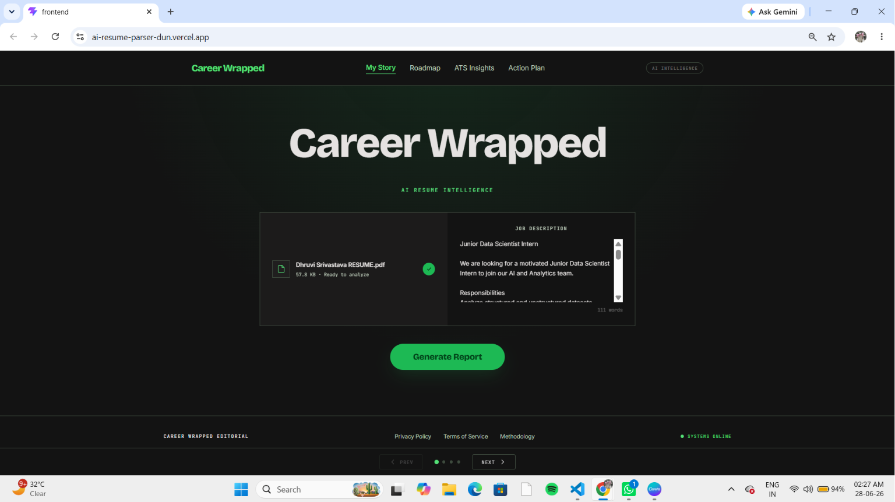
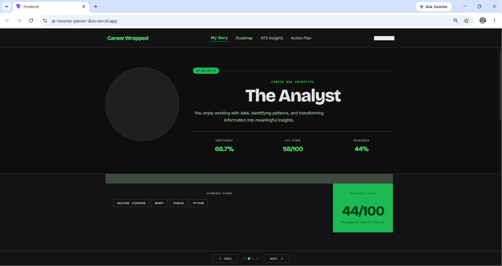
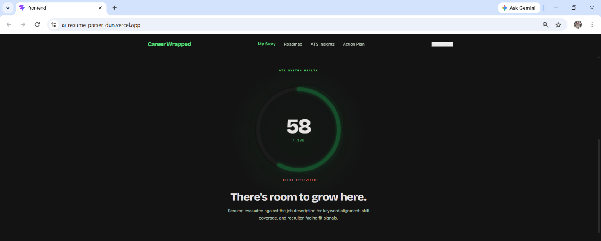
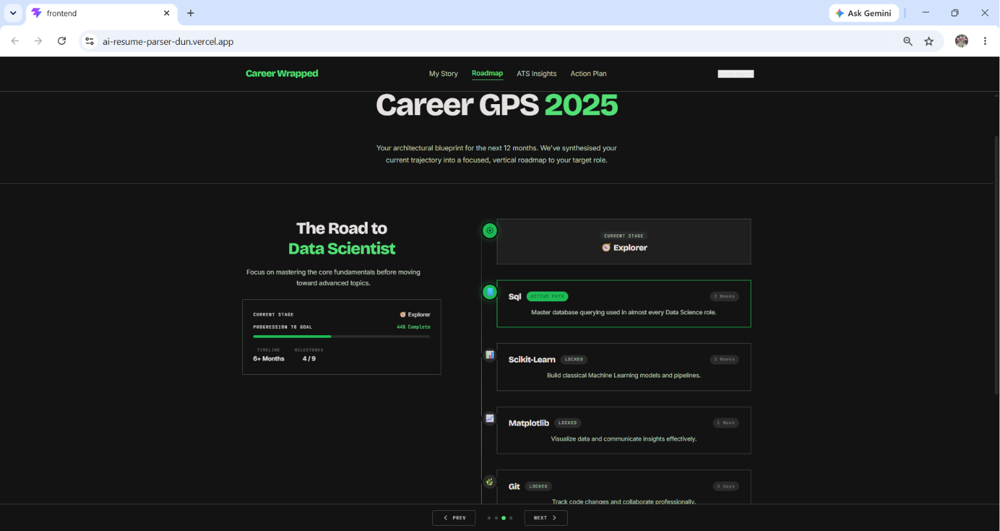
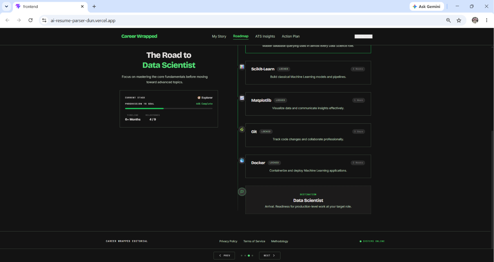
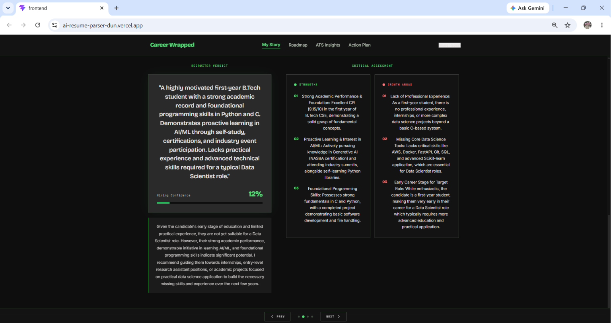
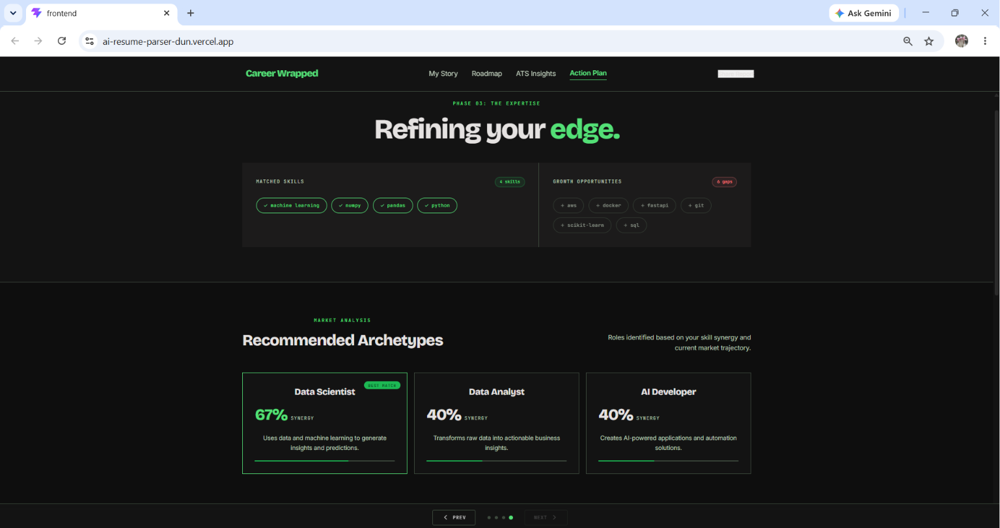
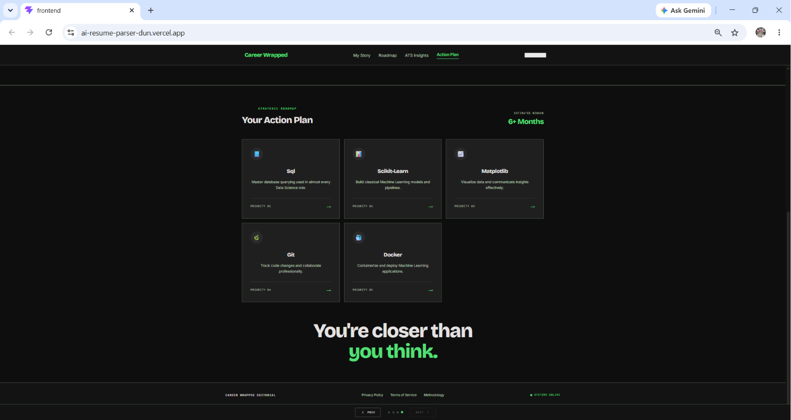

# Career Wrapped
### AI-Powered Career Intelligence Platform

**An AI-powered resume analysis platform that parses resumes, scores them against job descriptions, identifies skill gaps, and generates career insights using Gemini AI.**


---

## 📌 Overview

AI Resume Parser is a full-stack web application that allows users to upload a resume (PDF or DOCX), provide a job description, and receive a comprehensive analysis. The backend parses the resume, calculates an ATS match score using semantic similarity, identifies matched and missing skills, infers a career personality archetype, recommends relevant roles, generates a career roadmap, and produces a structured recruiter-style report via Gemini AI.

It was built to give job seekers actionable, data-backed feedback on how well their resume aligns with a target role — going beyond simple keyword matching to include semantic skill comparison and AI-generated narrative summaries.

---

## 🌐 Live Demo

| Service | URL |
|---|---|
| Frontend | `https://careerwrapped-ai.vercel.app` |
| Backend API | `<placeholder>` |

---

## ✨ Features

- **Resume Upload** — Accepts PDF and DOCX files
- **ATS Match Score** — Semantic similarity scoring between resume and job description
- **Skill Matching** — Identifies skills present in both resume and job description
- **Missing Skill Detection** — Highlights skills required by the JD that are absent from the resume
- **Career Personality** — Infers a career archetype based on extracted skills
- **Recommended Roles** — Suggests job roles aligned with the candidate's skill profile
- **Career GPS Roadmap** — Generates a step-by-step career progression path toward a target role
- **AI Recruiter Report** — Produces a structured recruiter-style summary via Gemini AI
- **Multi-Resume Ranking** — Ranks multiple uploaded resumes against a single job description
- **PDF Report Export** — Client-side PDF generation using jsPDF and html2canvas
- **Responsive UI** — Built with Tailwind CSS v4

---

## 📸 Screenshots


















---

## 🛠️ Tech Stack

### Frontend
| Technology | Version | Purpose |
|---|---|---|
| React | 19 | UI framework |
| Tailwind CSS | 4 | Styling |
| Axios | 1.18 | HTTP client |
| jsPDF | 4.2 | PDF export |
| html2canvas | 1.4 | DOM-to-image for PDF |
| Vite | 8 | Build tool |

### Backend
| Technology | Version | Purpose |
|---|---|---|
| FastAPI | 0.138 | API framework |
| Uvicorn | 0.49 | ASGI server |
| PyMuPDF | 1.27 | PDF text extraction |
| python-docx | 1.2 | DOCX text extraction |
| Sentence Transformers | 5.6 | Semantic skill matching |
| scikit-learn | 1.9 | Similarity computation |
| PyTorch | 2.12 | Transformer model runtime |

### AI
| Technology | Purpose |
|---|---|
| Google Gemini AI (`google-generativeai`) | Recruiter report generation |
| Sentence Transformers | Semantic embedding for ATS scoring |

### Deployment
| Service | Role |
|---|---|
| Vercel | Frontend hosting |
| Render | Backend API hosting |

---

## 🏗️ Project Architecture

```
User
  │
  ▼
React Frontend (Vite + Tailwind)
  │  Uploads resume file + job description text
  ▼
FastAPI Backend (/analyze-resume)
  │
  ├─► Resume Parser (PyMuPDF / python-docx)
  │     └─► Extracted resume text
  │
  ├─► ATS Match Scorer (Sentence Transformers + cosine similarity)
  │     └─► match_score (0–100)
  │
  ├─► Skill Matcher (compare_skills / extract_skills)
  │     ├─► matched_skills
  │     └─► missing_skills
  │
  ├─► Career Personality (get_career_personality)
  │     └─► personality archetype
  │
  ├─► Recommended Roles (get_recommended_roles)
  │     └─► ranked role suggestions
  │
  ├─► Career GPS (get_career_gps)
  │     └─► step-by-step roadmap to target role
  │
  └─► Recruiter AI Report (Gemini AI via google-generativeai)
        └─► narrative recruiter summary

  ▼
JSON Response → Frontend renders results + optional PDF export
```

---

## 📁 Folder Structure

> Based on the files provided. Subfolders inferred from imports in `main.py`.

```
ai-resume-parser/
├── backend/
│   ├── main.py                   # FastAPI app and all route definitions
│   ├── requirements.txt          # Python dependencies
│   ├── uploads/                  # Temporary storage for uploaded files
│   └── utils/
│       ├── parser.py             # PDF and DOCX text extraction
│       ├── matcher.py            # ATS match score calculation
│       ├── skill_matcher.py      # Skill extraction and comparison
│       ├── career_personality.py # Career archetype inference
│       ├── recommended_roles.py  # Role recommendation logic
│       ├── career_gps.py         # Career roadmap generation
│       ├── ranker.py             # Multi-resume ranking
│       └── recruiter_ai.py       # Gemini AI recruiter report
│
└── frontend/
    ├── package.json              # Node dependencies and scripts
    ├── vite.config.js            # Vite configuration
    ├── index.html
    └── src/
        └── ...                   # React components and pages
```

---

## ⚙️ Installation

### Prerequisites

- Python 3.10+
- Node.js 18+
- A Google Gemini API key

### 1. Clone the Repository

```bash
git clone https://github.com/<your-username>/ai-resume-parser.git
cd ai-resume-parser
```

### 2. Backend Setup

```bash
cd backend
python -m venv venv
source venv/bin/activate        # Windows: venv\Scripts\activate
pip install -r requirements.txt
```

### 3. Frontend Setup

```bash
cd frontend
npm install
```

### 4. Environment Variables

Create a `.env` file in the `backend/` directory:

```env
GEMINI_API_KEY=your_google_gemini_api_key_here
```

Create a `.env` file in the `frontend/` directory:

```env
VITE_API_URL=https://ai-resume-parser-b0md.onrender.com
```

### 5. Run Locally

**Backend:**
```bash
cd backend
uvicorn main:app --reload
```

**Frontend:**
```bash
cd frontend
npm run dev
```

The frontend runs at `https://careerwrapped-ai.vercel.app` and the API at `https://ai-resume-parser-b0md.onrender.com`.

---

## 🔑 Environment Variables

| Variable | Location | Description |
|---|---|---|
| `GEMINI_API_KEY` | `backend/.env` | API key for Google Gemini. Used by `recruiter_ai.py` to generate the AI recruiter report. Obtain from [Google AI Studio](https://aistudio.google.com). |
| `VITE_API_URL` | `frontend/.env` | Base URL of the FastAPI backend. Used by Axios to make API requests from the frontend. Set to `https://ai-resume-parser-b0md.onrender.com` Render deployment URL in production. |

---

## 📡 API Endpoints

| Method | Route | Description |
|---|---|---|
| `GET` | `/` | Health check — returns API status message |
| `POST` | `/upload-resume` | Uploads a resume file, extracts and returns text (first 3000 chars) |
| `POST` | `/job-description` | Accepts and echoes a job description string |
| `POST` | `/match-score` | Returns ATS match score for resume text vs. JD text |
| `POST` | `/analyze-resume` | Full analysis: score, skills, personality, roles, GPS, recruiter report |
| `POST` | `/skill-analysis` | Returns matched and missing skills between resume and JD |
| `POST` | `/recruiter-analysis` | Returns match score, skill comparison, and a short recruiter summary |
| `POST` | `/rank-resumes` | Ranks hardcoded sample candidates against a JD (demo endpoint) |
| `POST` | `/rank-uploaded-resumes` | Ranks multiple uploaded resume files against a JD |

---

## 🔄 Workflow

Here is what happens when a user uploads a resume and job description through the frontend:

1. **File Upload** — The user selects a PDF or DOCX resume and pastes a job description. The frontend sends a `multipart/form-data` POST request to `/analyze-resume`.

2. **File Storage** — The backend saves the uploaded file to the `uploads/` directory on the server.

3. **Text Extraction** — Depending on file type, `extract_pdf_text` (via PyMuPDF) or `extract_docx_text` (via python-docx) parses the file into plain text.

4. **ATS Scoring** — `calculate_match_score` encodes both the resume text and JD using a Sentence Transformer model and computes their cosine similarity, returning a 0–100 match score.

5. **Skill Analysis** — `compare_skills` identifies which skills from the JD appear in the resume (matched skills) and which do not (missing skills). `extract_skills` returns a list of skills found in the resume.

6. **Career Personality** — `get_career_personality` maps the extracted skills to a career archetype (e.g., Data Scientist, Backend Engineer).

7. **Role Recommendations** — `get_recommended_roles` returns a ranked list of job roles suited to the candidate's skill profile.

8. **Career GPS** — `get_career_gps` generates a step-by-step learning and progression roadmap toward the top recommended role.

9. **Recruiter Report** — `generate_recruiter_report` sends the resume text, score, skills, personality, roles, and GPS data to Gemini AI, which returns a structured recruiter-style narrative report.

10. **JSON Response** — All results are returned as a single JSON object. The frontend renders them across multiple UI sections and optionally allows the user to export the full report as a PDF.

---

## 🚀 Deployment

### Frontend — Vercel

1. Push the `frontend/` directory to a GitHub repository.
2. Import the repository into [Vercel](https://careerwrapped-ai.vercel.app).
3. Set the root directory to `frontend/`.
4. Add the environment variable `VITE_API_URL` pointing to your Render backend URL.
5. Vercel auto-detects Vite and deploys on each push to `main`.

### Backend — Render

1. Push the `backend/` directory to a GitHub repository.
2. Create a new **Web Service** on [Render](https://ai-resume-parser-b0md.onrender.com).
3. Set the build command: `pip install -r requirements.txt`
4. Set the start command: `uvicorn main:app --host 0.0.0.0 --port 10000`
5. Add the environment variable `GEMINI_API_KEY` in the Render dashboard.
6. Render deploys automatically on each push to `main`.

> **Note:** The CORS configuration in `main.py` includes both `https://careerwrapped-ai.vercel.app` and the production Vercel URL. Update the `allow_origins` list if your frontend URL changes.

---

## 🔮 Future Improvements

- Add user authentication so candidates can save and revisit past analyses
- Persist analysis results in a database (e.g., PostgreSQL) instead of re-running on each request
- Clean up the `uploads/` directory automatically after processing to avoid disk accumulation
- Replace the hardcoded candidate data in `/rank-resumes` with a proper multi-upload flow
- Add support for `.txt` resume files
- Improve skill extraction accuracy with a curated skills taxonomy or NER model
- Stream the Gemini AI response to the frontend for faster perceived performance
- Add rate limiting to the API to prevent abuse in production

---

## 📄 License

This project is licensed under the [MIT License](LICENSE).

---

## 👤 Author

**`<Dhruvi Srivastava>`**

- GitHub: [https://github.com/Dhruvu2704]
- LinkedIn: [www.linkedin.com/in/dhruvi-srivastava-317627375]
- Portfolio: `https://dhruvi-portfolio-new-portfolio.vercel.app`